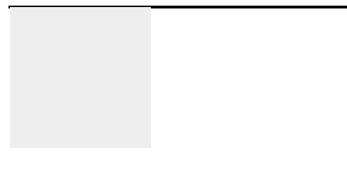
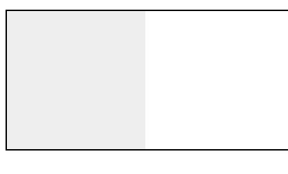

# 介绍下BFC及其应用

1.概念：Formatting context(格式化上下文)是W3C CSS2.1规范中的一个概念。它是页面中的一块渲染区域，并且有一套渲染规则，它决定了其子元素将如何定位，以及和其他元素的关系和相互作用。

2.定义：BFC即Block Formatting Contexts(块级格式化上下文)，它属于上述定位方案的普通流。
  **具有BFC特性的元素可以看做是个例了独立容器，容器里面的元素不会在布局上影响到外面的元素，并且BFC具有普通容器所没有的一些特性。**
  通俗一点来讲，可以把BFC理解为一个封闭的大箱子，箱子内部的元素无论如何操作，都不会影响到外部。

3.触发BFC
  只要元素满足下面一条条件即可触发BFC特性：
  * body 根元素
  * 浮动元素：float 除 none 以外的值
  * 绝对定位元素：position ( absolute、fixed )
  * display 为inline-block 、table-cells、flex
  * overflow 除了visible以外的值 (hidden、auto、scroll)

4.BFC特性及应用
 * 同一个BFC下外边距会发生折叠
 ```javascript
    <head>
      div{
        width:100px;
        height:100px;
        background:linghtblue;
        margin: 100px;
      }
    </head>
    <body>
      <div></div>
      <div></div>
    </body>
 ```
 ;
 从效果上看，因为两个div元素都处于同一个BFC容器下（这里指的是body元素），所以第一个div的下边距和第二个div的上边距发生了重叠，所以两个盒子之间距离只有100px，而不是200px。<br/>
 首先这不是CSS的bug，我们可以理解为一种规范，**如果想要避免外边距的重叠，可以将其放飞在不同的BFC容器中。** <br/>
 ```javascript
  <div class="container">
    <p></p>
  </div>
  <div class="container">
      <p></p>
  </div>

  .container {
    overflow: hidden;
  }
  p {
      width: 100px;
      height: 100px;
      background: lightblue;
      margin: 100px;
  }
 ``` 
  这时候，两个盒子边距就变成了 200px 

  
  
  * BFC可以包含浮动的元素(清除浮动)
  我们都知道，浮动的元素会脱离普通文档刘，来看下下面的一个例子
  ```javascript
    <div style="border:1px solid #000">
      <div style="width:100px; height: 100px; background: #eee; float:left"></div>
    </div>
  ```
  

  由于容器内元素浮动，脱离了文档流，所以容器只剩下2px的边距高度。如果使触发触发的BFC，那么容器将会包裹着浮动元素。
  ```javascript
    <div style="border: 1px solid #000; overflow: hidden;">
      <div style="width: 100px; height: 100px; background: #eee; float:left;"></div>
    </div>
  ```
  效果图如下：
  
  
  * **BFC可以阻止元素被浮动元素覆盖**
  先来看一个文字环绕效果:
  ```javascript
    <div style="height: 100px;width: 100px;float: left;background: lightblue">我是一个左浮动的元素</div>
    <div style="width: 200px; height: 200px;background: #eee">
      我是一个没有设置浮动,也没有触发 BFC 元素, width: 200px; height:200px; background: #eee;
    </div>
  ```
   效果图如下：
   

   这时候其实第二个元素有部分被浮动元素所覆盖，（但是文本信息不会被浮动元素覆盖）如果想避免元素被覆盖，使第二个元素的BFC特性，在第二个元素中加入`overflow：hidden`，
   ;

   这个方法可以用来实现两列自适应布局，效果不错，这时候左边的宽度固定，右边的内容自适应宽度(去掉上面右边内容的宽度)。