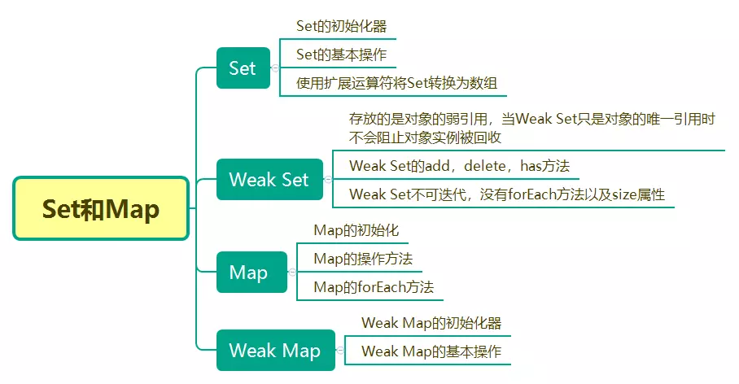

# 针对一些面试题的自我总结
# HTTP
### http的三次握手四次挥手过程
1. 概念：HTTP协议是因特网上应用最为广泛的一种网络传输协议，所有的WWW文件必须遵循这个标准。
2. HTTP是一个基于TCP/IP通信协议来传递数据。
3. 网络模型
  
  

  从图中可知，http位于应用层，TCP位于传输层。

  以下是低三层的作用：
  * 物理层主要作用是定义物理设备如何传输数据（网口，网线，光缆等）。
  * 数据链路层在通信实体间建立数据链路连接。
  * 网络层为数据在结点之间传输创建逻辑链路。
4. 为什么要进行TCP的三次握手？
  * 主要是为了防止服务端开启一些无用的链接。对对方做的请求做出答复，是否是关闭，是否是需要开启请求。例如，客户端对服务端发送第一次握手，服务端做了相应，而此时客户端关闭，导致服务端的端口会一直处于等待的状态，浪费资源。
  
  

  * TCP的三次握手实际上是发送三个报文段。（创建链接） <br/>
    <!-- * 第一次握手：客户端发送一个数据包给服务端，SYN标志位为1，Seq=X
    * 第二次握手：服务端发送一个数据包给客户端，SYN标志位为1，ACK=上面的Seq+1 = X+1，Seq=Y
    * 第三次握手：客户端发送一个数据包给客户端，ACK=Y+1，Seq=z -->

     第一次握手：主机A发往主机B，主机A的初始序号是X，设置SYN位，未设置ACK位

　   第二次握手：主机B发往主机A，主机B的初始序号是Y，确认号(ACK)是X+1，X+1确认号暗示己经收到主机A发往主机B的同步序号。设置SYN位和ACK位

　  第三次握手：主机A发往主机B，主机A的序号是X+1，确认号是Y+1，Y+1确认号暗示已经收到主机B发往主机A的同步序号。设置ACK位，未设置SYN位

  * TCP的四次挥手，实际上是发送4个报文段（断开链接） <br/>
     
     第一次挥手：客户端发送一个FIN段，并包含一个希望接受者看到的自己当前的序列号K。他欧诺个时还包含一个ACK表示确认对方最近一次发过来的数据。
     
     第二次挥手：服务端将K值加1作为ACK序号之，表名收到了上一个包。这时上层的应用程序会被告知另一端发起了关闭操作，通常这将引起应用程序发起自己的关闭操作。
     
     第三次挥手：服务端发起自己的FIN段，ACK=K+1，Seq=L。
     
     第四次挥手：客户端确认 ACK=L+1。

  * 为什么要四次挥手?
    这是因为服务端在LISTEN状态下，收到建立链接请求的SYN报文后，把ACK和SYN放在一个报文里发送给客户端。而关闭链接时，当收到对方的FIN报文时，仅仅表示对方不在发送数据了，但是还是能接收数据，己方是否现在关闭发送数据通道，需要上层应用来决定，因此，己方ACK和FIN一般都会分开发送。


### TCP为什么不是4次握手，2次挥手？
  《计算机网络》第四版中讲“三次握手”的目的是“为了防止已失效的连接请求报文段突然又传送到了服务端，因而产生错误”。

### HTTP报文
  


### URI、URL、URN
  * URI：统一资源标志符，是包含URL和URN总合的一个定义。特定某一个资源而去设置的，用来唯一标识互联网上的信息资源。将http://www.baidu.com指向到百度的页面（其中也涉及到DNS域名解析服务器）。
  * URL：统一的资源定位器。
  * URN：永久统一资源定位符。在资源移动之后还能被找到，目前还没有非常成熟的使用方案。

### HTTPS
  1. HTTP是明文传输的，类似裸奔。容易被劫持。
  2. HTTPS为什么是安全的？
    * 公钥放在公网上每个人都能拿到的加密字符串。加密字符串是用来加密传输的信息的，只有服务器上有私钥来对加密后的数据进行解密。中间过程中，中间人是无法拿到私钥的，因为私钥只放在服务器上。公钥和私钥主要是在握手的过程中进行传输。

  

  * 第一次握手：客户端生成一个随机数Random及加密套件给服务端，服务端接受客户端发来的随机数和加密套件后，选择一个它认为合适的加密套件
  * 第二次握手：服务端生成一个随机数，将该随机数和服务端证书发给客户端，客户端根据服务端发来的证书进行生成一个预主秘钥
  * 第三次握手：将证书生成的预主秘钥加密，生成一个随机数，将随机数和加密后的预主秘钥发给服务端，但该随机数是不能被中间人拿到的，只有客户端和服务端知道的随机数。服务端将加密的预主秘钥进行私钥解密。
  * 第四次握手：服务端和客户端将前三次握手生成的随机数进行一个算法操作。进行加密数据传输，这里中间人无法解密，因为中间人没有私钥，同时也没有第三次握手时生成的随机数，所以保证了数据传输的安全性。

# 从URL输入到页面渲染的过程

  1. 浏览器构建HTTP Request请求
  2. 网络传输
  3. 服务器构建HTTP Response响应
  4. 网络传输
  5. 浏览器渲染页面
  
  

  

#### 构建请求
  1. 应用层进行DNS解析。DNS将域名解析成IP地址。
  2. 应用层生成HTTP请求报文。（报文格式见上文）
  3. 传输层简历TCP链接。HTTP协议使用的是TCP协议。（具体的TCP握手过程见上文）
  4. 网络层使用IP协议来选择路线
  5. 数据链路层实现网络相邻节点间可靠的数据通信
  6. 物理层传输数据
  **总结：**<br/>
  上面的6个步骤可总结为：DNS解析URL地址；HTTP生成报文；构建TCP链接；使用IP协议选择传输路线；数据链路层保证数据的可靠传输；物理层将数据转换成电子、光学或微波信号进行传输。

#### 网络传输
  从客户机到服务器需要通过许多网络设备，一般地，包括集线器，交换器，路由器等。
 
# ES6 中Set、Map类型的内部实现
> 主要知识点：Set的基本操作，Weak Set，Map的基本操作，Weak Map
 

### 1.ES6中的Set
 <!-- ES6中提供了Set数据容器，这是一个能够`存储无重复值的有序列表`。
 通过`new Set()`可以创建Set，然后通过`add`方法能够向Set中添加数据项
  -->
 原来`Set`是一个`集合`的数据结构，`Map`是一种叫`字典`的数据结构。
 ##### 集合
 * 集合是由一组无序切不重复的项组成,可以想象集合是一个既没有重复元素又没有顺序概念的数组。
 * ES6中提供了新的数据结构Set。它类似数组，但是它的成员时唯一的，没有重复的值。
 * Set本身就是一个构造函数，用来生成Set结构
 ```javascript
  let set  = new Set();
  set.add(1);
  set.add("1");
  console.log(set.size()) // 2
 ```
 ##### Set实例的属性和方法
 * Set的属性：set.size();返回集合中元素的数量
 * Set的方法：
  * 操作方法：
    * add(val) ：向集合中添加新的项
    * delete(val) ： 删除集合中一个项
    * has(val) ：判断该值是否存在于集合中，返回Boolean
    * clear() ：将集合清空
  * 遍历方法：
    * keys() ：返回一个包含集合中所有键的数组
    * values() ：返回一个包含集合中所有值的数组
    * entries() ：返回一个包含集合中键值对的数组(实用性不高)
    * forEach() ：用于对集合成员执行某种操作，没有返回值。
    
 ##### has方法
 首先要实现的是has方法，因为在add或delete等方法中都会调用，下面看看它的实现
 ```javascript
    function Set(){
      let items={};
      this.size = 0 ; 
      this.has=function(val){
        // 对象都有hasOwnProperty方法，判断是否拥有特性属性
        return items.hasOwnProperty(val);
      }
    }
 ```

 ##### add方法
 ```javascript
  this.add = function(val){
    if(!this.has(val)){
      items[val] = val;
      this.size++
      return true
    }
    return false
  }
 ``` 

 ##### delete和clear方法
 ```javascript
  this.delete = function(val){
    if(this.has(val)){
      delete items[val];
      this.size --;
      return true;
    }
    return false;
  }

  this.clear= function(){
    items = {};
    this.size = 0 ;
  }

 ```

 ##### keys和values方法
  可通过ES6对Object的扩展可以轻松实现对应的方法：
 ```javascript
  this.keys = function(){
    return Object.keys(items); // 返回遍历集合的所有键名的数组
  }

  this.values = function(){
    return Object.values(items); // 返回遍历集合的所有键值的数组 
  }
 ```
  需要注意的是，Object的这几个方法都是按照值大小，从小到大遍历的数组。

  ##### forEach方法
  

 # React 
 ### React与vue的差异
  从数据双向绑定、组件及数据流、路由、状态管理等方面来分别对比一下怎样去使用Vue和React。

 ##### 数据双向绑定
  什么是数据双向绑定：View层和Model层的数据相互影响。
  View层的表但操作、触发时间可能会引起数据变动；ajax请求也可能会引起数据变动，某一数据变动引起另外关联数据的改变。

 ##### React的设计思想
   从设计上看，React无法和其他框架直接对比，React不是一个MVC框架，而是一个用于构建组件化的UI库，是一个前端界面开发工具。在MVC中属于V层。React并没有重复造轮子，而是有很多颠覆性的创新，具体如下：
   * 编写简单直观的代码：丹神解释，React最大价值不是高性能的虚拟DOM、封装事件机制、服务端渲染，而是声明式的直观的编码方式。
   * 简化可复用的组件

 ### 怎么理解虚拟(Virtual) DOM
  概念：改变真实DOM状态有庀改变一个JavaScript对象的花销要大得多。
  Virtual DOM 是一个映射真实DOM的JavaScript对象，如果需要改变任何元素的状态，那么是现在Virtual DOM上进行改变，而不是直接改变真实DOM。当有变化产生时，一个新的Virtual DOM对象会被创建并计算新旧Virtual DOM之间的差别（这里涉及到Diff算法）。之后这些差别会应用在真实的DOM上。

 ### Diff算法
  1. diff算法的作用：计算出Virtual DOM中真正变化的部分，并只针对该部分进行原生DOM操作，而非重新渲染真个页面。
  2. 传统的diff算法：通过循环递归对节点进行依次对比，算法复杂度达到O(n^3)，n是树的节点数。比如1000个节点，会进行上亿次的比较。
  

 ### setState是真正的异步嘛？什么时候是异步？什么时候是同步？
  1. setState并不是真正的异步，只是在实现上产生异步的错觉。他还是同步的。dan神给出的两个理由：
    * 保证内部数据的统一

    ```javascript
      console.log(this.state.value); // 0
      this.setState({ value : this.state.value + 1 }); 
      console.log(this.state.value); // 1
      this.setState({ value : this.state.value + 1 }); 
      console.log(this.state.value); // 2
    ```
    在上面一段代码中，在state中，setState同步是可以的。但是到了props传值时，也用同步setState的模式就会有问题。

    ```javascript
      console.log(this.props.value) // 0
      this.props.onIncrement();
      console.log(this.props.value) // 0
      this.props.onIncrement();
      console.log(this.props.value) // 0
    ```
    父节点传递给子节点的props是不能同步刷新的，setState同步re-render是很差的机制。无法同步re-render，就无法同步刷新this.props，无法保证子节点拿到的props和父节点的state一致。破坏了内部数据统一。

    * setState异步更新状态使得并发更新组件成为可能
    首先讨论是否同步刷新state有一个前提那就是我们默认更新节点是在遵循特定的顺序的。但是按默认顺序更新组件在以后的react中可能就变了。哎以后的react的更新机制中，我们可能加入setState优先级这一概念。举个栗子：比如你现在正在打字，那么TextBox组件需要实时的刷新。但是当你在输入的时候，来了一个信息，这个时候，可能让信息延后刷新可能更符合交互。异步rendering不仅仅在性能上的优化，而且这可能是react组件模型在发生的根本性的改变。

    * 总结：
      * setState只在合成时间和钩子函数中是“异步”的，在原生时间事件和setTimeout中都是同步的。
      * setState的“异步”并不是说内部由异步代码实现，其实本身执行的过程和代码都是同步的，只是在合成事件和钩子函数的调用顺序在更新之前，导致合成事件和钩子函数中没法立刻拿到更新后的值，形成了所谓的“异步”。
      * setState的批量更新优化也是建立在“异步”之上的，原生事件和setTimeout中不会批量更新，在“异步”中如果对同一个值进行多次setState，setState的批量更新策略会对其进行覆盖，去最后一次的执行，如果是同时setState多个不同的值，在更新时会对其进行合并批量更新。  
    

 ### forceUpdate强制render经历了哪些生命周期，子组件呢？
   componentWillUpdate
   render
   componentDidUpdate
   <br/>
   调用forceUpdate() 将会导致render() 方法在相应的组件上被调用，并且子级组件也会调用自己的render()。但是如果标记改变了，那么React仅会更新DOM。
   <br/>
   通常情况下，应该尽量避免所有使用forceUpdate()的情况，在render()中仅从this.props和this.state中读取数据。这会使应用大大简化，并且更加高效。

 ### React的性能优化手段

 ### fragment的实现


 # Promise的实现原理，并手写Promise的实现
 ### promise是什么
 > A promise represents the eventual result of an asynchronous operation. --Promises/A+
 > A Promise is an object that is used as a placeholder for the eventual results of a deferred (and possibly asynchronous) computation.  --ECMAscript
  `Promise/A+`规范中标识为一个异步操作的最终结果，`ECMAscript`规范定义为延时或异步计算最终结果的占位符。严格来说，`Promise`是一种封装和组合未来值得易于复用机制，实现关注点分离，异步流程控制，异常冒泡，串行/并行控制等。
  
### thenable对象
  `thenable`是一个定义`then(...)`方法的对象或函数。`thenable`对象的存在目的是使`Promise`的实现更具有通用性，只要其暴露出一个遵循`promise/A+`规范的`then(...)`方法。同时也会使遵循`promise/A+`规范的实现可以与那些不太规范但可用的实现能良好共存。

  识别`thenable`或行为类似`Promise`对象可以根据其是否具有`then(...)`方法来判断，这其实叫`类型检查`也可以叫`鸭式辨型`。对于`thenable`值鸭式类型检测大致类似于：
  ```javascript
    if( p !== null && 
        (
          typeof p === "function" || 
          typeof p === "object"
        ) &&
        typeof p.then === "function"
     ){
      //  thenable
     }else {
      //  非 thenable
     }
  ```
### then 回调异步执行
 `promise`实例化时传入的函数会立即执行，`then(...)`中的回调需要异步延迟调用。在ESMAscript中规定明确`prosmie`是`微任务(micro-task)`。在执行任务时，JS引擎会将所有的任务按类别分为两个队列，首先是`宏任务(macro-task)`也叫`task queue`中取出一个任务，执行完后的，会在第一轮执行的宏任务中是否有微任务，有微任务的话立即执行，执行完后到浏览器渲染，然后再进行下一轮的宏任务执行。

### Promise状态
`promise`必须为以下三种状态之一：等状态（pendding）、执行态（Fulfilled）和拒绝态（Rejected）。一旦`promise`被`resolve`或`reject`,不能再迁移至其他任何状态（即状态`immutable`）。

### Promise构造函数
从构造函数开始，一步一步实现`promise/A+`规范的`promise`。大概描述下，`promise`构造函数需要做什么事情。
```javascript
  function Promimse(fn){
    // 省略非new 实例化方式处理
    // 省略 fn 非函数异常处理

    // promise状态变量
    // 0 - pending
    // 1 - resolved
    // 2 - rejected 
    this._state = 0 ;
    // promise的执行结果
    this._value  = null;

    // then(...)注册回调处理数组
    this._deferreds = [] ;
    
    // 立即执行fn函数
    try{
      fn(value=>{
        resolve(this, value);
      },reason=>{
        reject(this, reason);
      })
    }catch(err){
      // 处理执行fn异常
      reject(this, err)
    }
  }
```

### then函数
`proimise/A+`提到规范专注于提供通用的`then`方法，`then`方法可以被用一个`promise`调用多次，每次返回新`promise`对象。`then`方法接受两个参数`onResolve`、`onRejected`（可选）。在`promise`被`resolve`或`reject`后，所有`onResolved`或`onRejected`函数须按照其注册顺序依次回调，且调用次数不超过一次。
根据上述，`then`函数执行流程大致为：
1、实例化空`promise`对象用来返回（保持`then`链式调用）
2、构造`then(...)`注册回调处理函数结构体
3、判断当前`promise`状态，`pending`状态存储延迟处理对象`deferred`，非`pending`状态执行`onResolved`或`onRejected`回调
4、...
```javascript
  Promise.prototype.then = function(onResolved , onRejected){
    var res = new Promise(function(){});

    // 使用 onResolved , onRejected 实例化处理对象 Handler
    var deferred = new Handler( onResolved , onRejected , res );

    // 当前状态为 pendding ，存储延迟处理对象=
    if(this._state === 0){
      this._deferreds.push(deferred);
      return res
    }

    // 当前 promise 状态不为pending
    // 调用handleResolved 执行 onResolved或onRejected回调
    handleResolved(this, deferred);

    // 返回新 promise 对象，维持链式调用
    return res;
  }
```

### 链式调用为什么要返回新的promise
 如我们理解，为保证`then`函数链式掉调用，`then`需要返回`promise`实例。但为什么返回新的`promise`，而不是直接返回`this`当前对象？看下面代码：
 ```javascript
  var promise2 =  promise1.then(function(value){
    return Promise.reject(3);
  });
 ```
 假如`then`函数执行返回`this`调用对象本身，那么`promise2 === promise1`，`promise2`状态也应该等于`promise1`同为`resolved`。而`onResolved`回调返回状态为`rejected`对象。考虑到`promise`状态一旦`resolved`或`rejected`就不能再迁移，所以这里`promise2`也没办法转为回调函数返回的`rejected`状态，产生矛盾。
 `handleResolved`函数功能未根据当前`promise`状态，异步执行`onResolved`或`onRejected`回调函数。因在`resolve`或`reject`函数内部同样需要相关功能，提取为单独模块。

 ### 手写JS实现promise
  `构造函数`
 ```javascript
    // 存储 mPromise
    let that;
    
    /*
    * 因为每次new mPromise（then ，catch的时候都需要链式调用）会调用 mPromise（constructor），所以放外面
    */

    // 状态、参数配置
    let concfig = {
        status : null,
        resolveParam: null,
        rejectParam: null
    };

    /*
    * mPromise函数：原生Promise 的手动实现
    * @param{ new Promise 时传入的回调函数 } callback
    */
    function mPromise(callback){
      that = this;
      // 往 new mPromise 时传入的回调函数，传回两个参数
      callback(that.resolve,that.reject)
    }
 ```
  `原型`
  ```javascript
    mPromise.prototype = {
        constructor: mPromise,
        resolve(param){
          config.resolveParam : null; // 重置resolve参数
          config.rejectParam : null;
          config.status : "PENDING"
        },
        then(_fn){
          // 有resolve 才调用
        }
    }
  ```