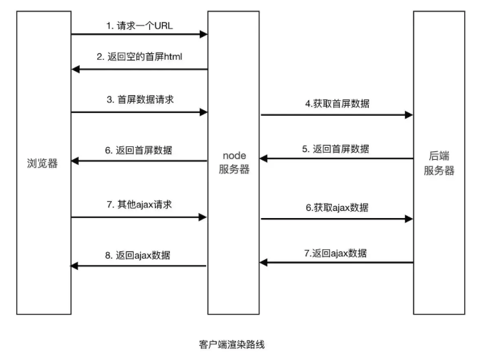
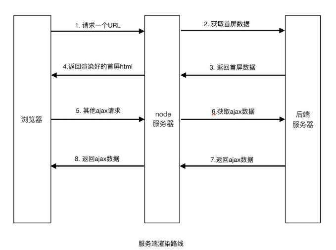

### SSR（基于nextjs）  SPA（基于react）
1. SPA(single page application)：单页应用，是前后端分离时提出的一种解决方案。

&emsp;&emsp;优点：网络传输数据量小、减少了服务器压力、前后端分离、局部刷新，无需每次请求完整页面、交互好

&emsp;&emsp;缺点：首屏速度慢，不利于SEO
  - 在React中，HTML文件只有一个根节点，通过ReactDOM.render将组件挂载到根节点上。页面内容不经过后端，是通过前端动态去渲染，导致浏览器难以抓取到页面中的信息，不利于SEO。
  - 在访问项目的时候，进行分包下载，尽管我们在webpack做了code split（代码分割），加上组件的异步按需加载，有效的优化了首屏速度，但是SPA是客户端渲染，在请求的过程中产生较多的耗时。

2. SSR(server side render)：服务端渲染。

&emsp;&emsp;优点：利于SEO。首屏速度快，用户体验好。平滑过渡，用法与react没有大的出入，上手快。

&emsp;&emsp;缺点：学习成本高。整体体验与SPA相比较差。维护成本高。开发效率降低。

 - 服务端渲染在最开始访问时，只会请求当前页面信息。此时请求是在服务端，服务端解析html加载js，请求首屏数据，填入html中，再返回给客户端。在network中可以看到该请求里面是整个带数据的html页面信息，对于浏览器来说，能够抓取到页面中的关键信息。有利于SEO。

 - 相应的也带来了一些弊端。在nextjs中需要写node中间层，需要熟悉express或者koa。增加了学习成本。在开发的过程，由于存在服务端和客户端，使用window、document对象时需要区分环境，服务端错误难以定位，降低效率。

- 客户端，输入的URL进行请求服务器，服务器返回HTML文件，浏览器解析。加载css、js文件，执行js代码，去获取首屏数据。首屏数据请求回来后再进行渲染到页面中。

- 服务端：根据输入的URL进行请求服务器，此时服务端将HTML文件与JS文件进行解析，请求首屏数据，拼接成完整的有数据的HTML再返回给客户端。这一步都在服务端进行完成，服务端处于内网环境，响应速度快。相比于客户端的外网请求来说，此过程的http请求开销小，首屏速度就有提升。

3. 技术选型

&emsp;&emsp;脱离业务去做技术选型纯属是在耍流氓。针对业务需求和技术优略性进行选择。后台管理的项目受众对象往往都是拥有管理性质的人员，使用SPA即可。若项目要求SEO，就选SSR。

